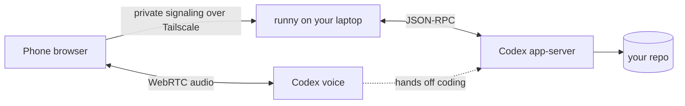

# runny

**Vibe code while running.**

Talk to Codex from your phone. It works in the repo on your laptop and tells you what happened in your headphones.

No API key. Use your ChatGPT login.

<p align="center">
  
</p>

## The loop

1. Start Runny in the repo on your laptop.
2. Open its private link on your phone and tap Start.
3. Say what needs doing. Codex gets to work while you keep moving.

## Install and run

You need Node.js 22 or newer, [Codex](https://github.com/openai/codex) 0.153 or newer signed in with ChatGPT, and [Tailscale](https://tailscale.com/download) on both your phone and laptop under the same account.

```sh
npm install -g github:Jonksar/runny
tailscale serve --bg 8765
cd your-repo
runny doctor
runny
```

Runny prints a `Phone:` link. Open it on your phone, allow the microphone, and tap Start. Keep your headphones in, laptop awake, and the phone page open.

## What is actually happening

Your phone sends voice directly to Codex over WebRTC. Runny runs on your laptop and connects the voice session to a Codex coding thread. It does not proxy your voice or require an API key.



Read the [architecture](docs/architecture.md), [protocol](docs/protocol.md), and [testing notes](docs/testing.md) if you want the details.

## Before the long run

- The phone-link token can control Codex in your repo. Treat it like a password.
- Codex runs with `workspace-write` and no approval prompts. Start in a clean checkout, or use `runny --sandbox read-only` for your first run.
- `tailscale serve` keeps Runny inside your tailnet. Do not use `tailscale funnel`.
- Voice use counts against your ChatGPT plan limits.
- Locked screens and marathons are still untested. Try a short loop first.

`runny --help` lists the options. MIT licensed.
