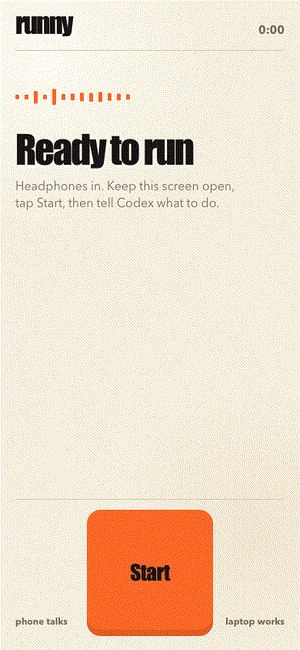
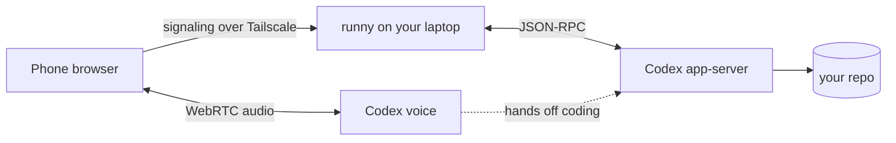

# runny

**Vibe code while running.**

Going outside was supposed to help. Now Codex comes with you.

<p align="center">
  
</p>

Runny puts **Codex voice chat** in your headphones. You talk, Codex codes on your laptop back home, then tells you how it went. It uses your ChatGPT login, so there's no API key to paste.

## How to aura farm while running

1. Run `runny` on your laptop, inside the repo.
2. Open the link it prints on your phone and tap **Start**.
3. Say what you want done. Keep running.

## Setup

You need:

- Node.js 22+
- [Codex](https://github.com/openai/codex) 0.153 or newer, signed in with ChatGPT (`codex login`)
- [Tailscale](https://tailscale.com/download) on your laptop and phone, same account

```sh
npm install -g github:Jonksar/runny
tailscale serve --bg 8765   # once: private HTTPS for your phone
cd your-repo
runny doctor
runny
```

`runny` prints a `Phone:` link. Open it on your phone, allow the microphone, tap **Start**. Headphones in, laptop awake, page open.

## How it works



Your voice goes straight to Codex. Runny just introduces your phone to it and starts a coding thread. Details: [architecture](docs/architecture.md), [protocol](docs/protocol.md), [testing](docs/testing.md).

## Before you run off

- The link's token controls Codex in your repo. Treat it like a password.
- Codex runs without approval prompts, in the `workspace-write` sandbox. Use a clean checkout, or `runny --sandbox read-only` for your first jog.
- `tailscale serve` keeps runny inside your tailnet. Don't use `tailscale funnel`.
- Voice counts against your ChatGPT plan limits.
- Locked screens and marathons are untested. Try a short loop first.

`runny --help` lists the options. MIT licensed.
